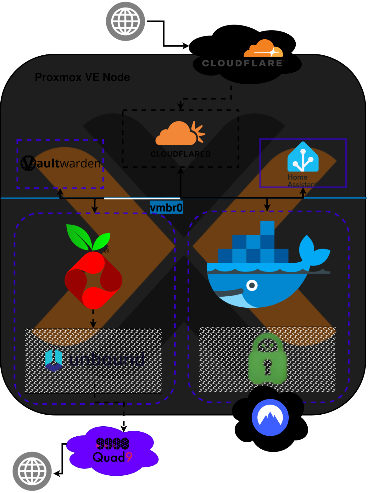

# Homelab & Infrastructure
Seit Mitte 2025 arbeite ich aktiv daran, meine Abhängigkeit von großen Cloudanbietern abzubauen und habe zu diesem Zweck einen Homeserver aufgesetzt. Dort hoste ich quelloffene Alternativen selbst und verteile die zur Verfügung stehenden Ressourcen so effizient, wie ich kann.

---

## Hardware
### Selbst konfigurierter und zusammengebauter PC
2023 habe ich mir den langjährigen Traum erfüllt, mir einen Gaming-PC zu bauen.

Von diesem Punkt ist das Wiederentdecken meiner Leidenschaft für die IT gestartet. Seitdem habe ich mich ununterbrochen technisch weiterentwickelt und meine Fähigkeiten und Kenntnisse ausgeweitet.

### Raspberry Pi 5
Nicht viel später habe ich nach einer Option gesucht, Spiele von meinem PC auf den Fernseher zu streamen, um dort mit Konsolenfeeling zu spielen. Ich habe mich informiert und mein erstes Networking-Projekt gestartet, indem ich einen Raspberry Pi als Client für das Open-Source Tool "Moonlight¹" einrichte und meinen Desktop vom PC aus mit Sunshine² ins Netzwerk streame. Nachdem das funktioniert hat, war ich angefixt und bin im nächsten Jahr weitere Selfhosting-Projekte mit meinem PC als Host angegangen.

### Dell Wyse 5070
2025 habe ich dann die nächste Eskalationsstufe meines neuen Hobbies erreicht und mich nach dedizierter Hardware für den Einsatz als Home-Server umgeschaut, da ich nach einem Umzug Smart-Home Geräte installieren wollte und dafür ein System gebraucht habe, das 24/7 in Betrieb bleiben kann. Zunächst dachte ich an einen weiteren Raspberry Pi, habe mich aber schließlich für einen wiederaufgearbeiteten Mini-PC entschieden, mit dem ich auch zukünftige Projekte umsetzen kann.
Diesen habe ich mit einer NVMe SSD und mehr Arbeitsspeicher aufgerüstet und als Server aufgesetzt.

---
## Software
### Betriebssysteme & Hypervisor
#### Desktop
Seit 2025 nutze ich Linux auf meinem Desktop. Aufgrund von Privacy-Bedenken, deplazierter Werbung und dem Wunsch, neue nützliche Fähigkeiten zu sammeln und mir Wissen anzueignen, habe ich mich entschieden, Windows zu verlassen. Die erste Distribution, die ich ausprobiert habe, war **Pop!_OS**³. Hier habe ich einige Monate mit gearbeitet, bis ich tiefer eintauchen wollte. Etwa seit Februar 2026 nutze ich **Arch Linux**⁴ und **Hyprland**⁵ als Desktop-Environment.

#### Homeserver
Meinen Server betreibe ich mit **Proxmox VE**⁶ als Virtualisierungsengine. Die Tools die ich dort hoste betreibe ich in isolierten Linuxcontainern, die ich mithilfe der Helper-Scripts aufsetze, die tteck zur Verfügung stellt⁷. Für modulare Dienste arbeite ich zusätzlich mit Docker (LINK ZU COMPOSE)⁸.

### Netzwerk & Zugriff
Damit ich immer und von überall aus auf Dienste zugreifen kann, die ich in meinem Netzwerk hoste, habe ich eine Domain bei Cloudflare registriert und einen Zero-Trust⁹ Tunnel in meinem LAN konfiguriert. Im Vergleich zu Proxys kann ich so offene Ports vermeiden, die Löcher in meine Firewall bohren und Sicherheitslücken schaffen. Gleichzeitig kann ich damit alle Prozesse outsourcen, die mit dem Zugriff auf mein LAN und dort gehostete Dienste zu tun haben und in einem übersichtlichen und verständlichen Dashboard zentralisieren, ohne die Kontrolle darüber abgeben zu müssen. Dadurch arbeite ich effizienter an meinen Projekten und profitiere von Enterprise-Level Security Standards. Kritische Oberflächen, wie das Proxmox-Environment selbst oder das Web-GUI meines Routers, kann ich so mit dem integrierten Identity & Access Management System vor Fremdzugriff schützen, ohne erst selbst lernen zu müssen, wie ich meinen Proxy mit einer zuverlässig funktionierenden und vor Angriffen geschützten 2FA-Maske absichere.

Das heißt allerdings nicht, dass ich mich nicht auch selbst mit Maßnahmen beschäftige, um meine Privatsphäre zu schützen und meine Cybersicherheit zu stärken. Beispielsweise ist der Traffic spezifischer Container-Stacks mittels VPN-Integration via Gluetun10 anonymisiert und durch eine Killswitch-Logik in Docker-Compose zusätzlich abgesichert. Vor bösartigen Websites, und damit indirekt vor Malware und Phishing, schütze ich mein Netzwerk durch Pi-Hole11, zur Wahrung der Privatsphäre gegenüber dem ISP nutze ich Unbound12 DNS-over-TLS via Quad9 DNS-Provider.

Meine Netzwerkarchitektur habe ich in diesem Diagramm noch einmal übersichtlich visualisiert:

#### Wartung
Wöchentliche System-Reboots meines Servers, verschlüsselte Cloud-Backups und Updates sind via Cronjobs automatisiert. Wenn unweigerlich mal etwas kaputt geht, mache ich mich selbst auf Fehlersuche und kümmere mich ums Troubleshooting.

---
# Referenzen

| Referenz | Tool / Projekt | Link |
| :--- | :--- | :--- |
| 1 | Moonlight | [Repository](https://github.com/moonlight-stream) |
| 2 | Sunshine | [Repository](https://github.com/lizardbyte/sunshine) |
| 3 | Pop!_OS | [Repository](https://github.com/pop-os) |
| 4 | Arch Linux | [Repository](https://github.com/archlinux) |
| 5 | Hyprland | [Repository](https://github.com/hyprwm/hyprland) |
| 6 | Proxmox VE | [Wiki](https://pve.proxmox.com/wiki/Main_Page) |
| 7 | Proxmox Helper Scripts | [Homepage](https://community-scripts.org/) |
| 8 | Docker | [Homepage](https://www.docker.com/) |
| 9 | Cloudflare Zero-Trust | [Homepage](https://www.cloudflare.com/lp/dg/brand/zero-trust/) |
| 10 | Gluetun | [Repository](https://github.com/qdm12/gluetun) |
| 11 | Pi-Hole | [Homepage](https://pi-hole.net/) |
| 12 | Unbound | [Homepage](https://nlnetlabs.nl/projects/unbound/about/) |
