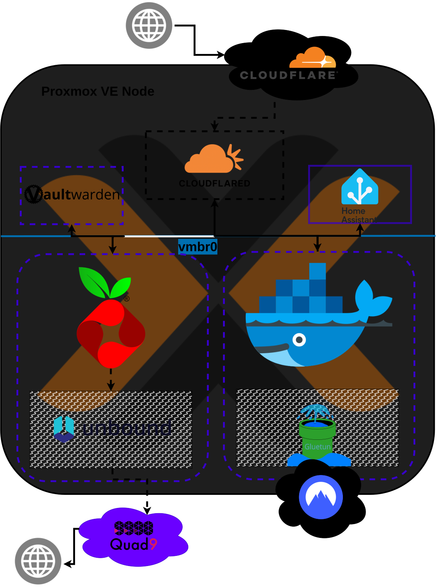

# 🏠 Homelab & Infrastructure

Schon seit meiner Kindheit faszinieren mich moderne Technologien. Da mir in meiner Jugend jedoch die Mittel für eigene Hardware fehlten, konnte ich mein technisches Interesse zunächst nicht tiefer in der Praxis verwurzeln – meine Begeisterung für die IT lebte ich daher über viele Jahre primär über die Welt der Videospiele aus. 

Im Jahr 2023 konnte ich mir schließlich den langjährigen Traum erfüllen, einen eigenen Gaming-PC von Grund auf selbst zu planen und zusammenzubauen. Mit diesem Meilenstein wurde das Wiederentdecken meiner Leidenschaft für die IT eingeleitet. Seitdem habe ich mich ununterbrochen technisch weiterentwickelt, mir tieferes Wissen angeeignet und meine praktischen Fähigkeiten kontinuierlich ausgeweitet.

Seit Mitte 2025 arbeite ich aktiv daran, meine Abhängigkeit von großen Cloud-Anbietern schrittweise abzubauen. Zu diesem Zweck habe ich einen eigenen Homeserver aufgesetzt, auf dem ich Open-Source Alternativen selbst hoste und die zur Verfügung stehenden Ressourcen so effizient wie ich kann verteile.

---

## 💻 Hardware

### Workstation

Der 2023 fertiggestellte Gaming-PC markiert den Startpunkt meines technischen Werdegangs.

### Raspberry Pi 5
Wenig später suchte ich nach einer Möglichkeit, Spiele von meinem PC auf den Fernseher zu streamen, um dort mit echtem Konsolenfeeling zu spielen. Nach entsprechender Recherche startete ich mein erstes echtes Networking-Projekt: Ich richtete einen Raspberry Pi 5 als Client für das Open-Source-Tool **Moonlight**¹ ein, während mein Desktop-PC das Signal mittels **Sunshine**² in das lokale Netzwerk streamt. Nachdem dieses Setup fehlerfrei lief, war meine Begeisterung endgültig geweckt und ich setzte im darauffolgenden Jahr weitere Selfhosting-Projekte um, für die ich meinen PC als Host nutzte.

### Dell Wyse 5070 (Homeserver)
Im Jahr 2025 folgte die nächste Stufe meines neuen Hobbys: Ich habe mich nach dedizierter Hardware für den dauerhaften Einsatz als Homeserver umgesehen. Auslöser war ein Umzug, im Zuge dessen ich Smart-Home-Geräte installieren wollte, was ein ausfallsicheres System voraussetzt, das 24/7 in Betrieb bleiben kann. 

Anstelle eines weiteren Einplatinencomputers entschied ich mich für einen wiederaufbereiteten x86-Mini-PC, um genügend Leistungsreserven für zukünftige Projekte zu haben. Diesen habe ich eigenständig mit einer NVMe-SSD sowie zusätzlichem Arbeitsspeicher aufgerüstet und als Server aufgesetzt.

---

## 🛠️ Software & Infrastruktur

### Betriebssysteme & Hypervisor

#### Desktop
Seit 2025 nutze ich Linux als primäres Betriebssystem auf meinem Desktop. Ausschlaggebend für den Wechsel weg von Windows waren zunehmende Datenschutzbedenken, deplatzierte Werbung im Betriebssystem sowie der gezielte Wunsch, neue technische Fähigkeiten aufzubauen. 

Meine Reise begann mit **Pop!_OS**³, womit ich einige Monate produktiv gearbeitet habe. Um noch tiefer in die Materie einzutauchen, gewöhne ich mir seit Februar 2026 die Nutzung von **Arch Linux**⁴ in Kombination mit **Hyprland**⁵ als Tiling Window Manager an.

#### Homeserver
Meinen Server betreibe ich auf Basis von **Proxmox VE**⁶ als Virtualisierungs-Engine. Die verschiedenen Dienste laufen hochgradig isoliert in schlanken Linux-Containern (LXC), die ich unter anderem mithilfe der Proxmox-Helper-Scripts von tteck⁷ aufsetze. Für modulare oder kurzlebige Dienste arbeite ich zusätzlich mit **Docker**⁸.

---

### 🌐 Netzwerk & Sicherer Zugriff

Um jederzeit und von überall aus sicher auf die Dienste in meinem Heimnetzwerk zugreifen zu können, nutze ich eine eigene Domain bei Cloudflare in Kombination mit einem **Zero-Trust-Tunnel**⁹ innerhalb meines LANs.

Im Vergleich zu klassischen Portweiterleitungen vermeide ich dadurch offene Ports, die potenzielle Angriffsvektoren in der Firewall darstellen würden. Gleichzeitig erlaubt mir dieser Ansatz, sämtliche Authentifizierungsprozesse zentralisiert über ein übersichtliches Dashboard zu steuern, ohne die Souveränität über meine Daten aufzugeben. 

Kritische Administrationsoberflächen (wie die Proxmox-Web-GUI oder das Dashboard meines Routers) sichere ich über das integrierte Identity & Access Management (IAM) ab. Dies bietet mir Enterprise-Level-Sicherheitsstandards und eine zuverlässige Zwei-Faktor-Authentifizierung (2FA), ohne dass ich fehleranfällige, eigene Reverse-Proxy-Masken von Grund auf selbst implementieren muss.

#### 🔒 Datenschutz & Cybersicherheit im LAN
Auch intern setze ich gezielte Maßnahmen um, um meine Privatsphäre zu schützen und das Netzwerk zu härten:
* **Anonymisierung:** Der Netzwerktraffic spezifischer Container-Stacks wird über eine VPN-Integration via **Gluetun**¹⁰ geleitet. Eine strikte Killswitch-Logik innerhalb von Docker Compose verhindert Datenlecks bei Verbindungsabbrüchen.
* **DNS-Filterung:** Ein zentraler **Pi-hole**¹¹ schützt alle Endgeräte im Netzwerk vor bösartigen Domains, Tracking und Phishing-Versuchen.
* **DNS-Privatsphäre:** Zur Wahrung der Privatsphäre gegenüber dem ISP filtert ein eigener **Unbound**¹²-DNS-Server die Anfragen und leitet sie verschlüsselt via *DNS-over-TLS (DoT)* an den zensurfreien Provider *Quad9*¹³ weiter.

Meine vollständige Netzwerkarchitektur habe ich in diesem Diagramm visualisiert:

#### 🔄 Wartung & Ausfallsicherheit
Wöchentliche System-Reboots des Servers, verschlüsselte Cloud-Backups der Konfigurationen sowie System-Updates sind über automatisierte **Cronjobs** geregelt. Sollten im Betrieb Fehler auftreten, nutze ich KI-Sprachmodelle bei der Log-Analyse und übernehme das Troubleshooting eigenständig.

---

# 📚 Referenzen

| Referenz | Tool / Projekt | Link |
| :--- | :--- | :--- |
| 1 | Moonlight | [Repository](https://github.com/moonlight-stream) |
| 2 | Sunshine | [Repository](https://github.com/lizardbyte/sunshine) |
| 3 | Pop!_OS | [Repository](https://github.com/pop-os) |
| 4 | Arch Linux | [Repository](https://github.com/archlinux) |
| 5 | Hyprland | [Repository](https://github.com/hyprwm/hyprland) |
| 6 | Proxmox VE | [Wiki](https://pve.proxmox.com/wiki/Main_Page) |
| 7 | Proxmox Helper Scripts | [Homepage](https://community-scripts.org/) |
| 8 | Docker | [Homepage](https://www.docker.com/) |
| 9 | Cloudflare Zero-Trust | [Homepage](https://www.cloudflare.com/lp/dg/brand/zero-trust/) |
| 10 | Gluetun | [Repository](https://github.com/qdm12/gluetun) |
| 11 | Pi-hole | [Homepage](https://pi-hole.net/) |
| 12 | Unbound | [Homepage](https://nlnetlabs.nl/projects/unbound/about/) |
| 13 | Quad9 | [Homepage](https://quad9.net/de/) |
