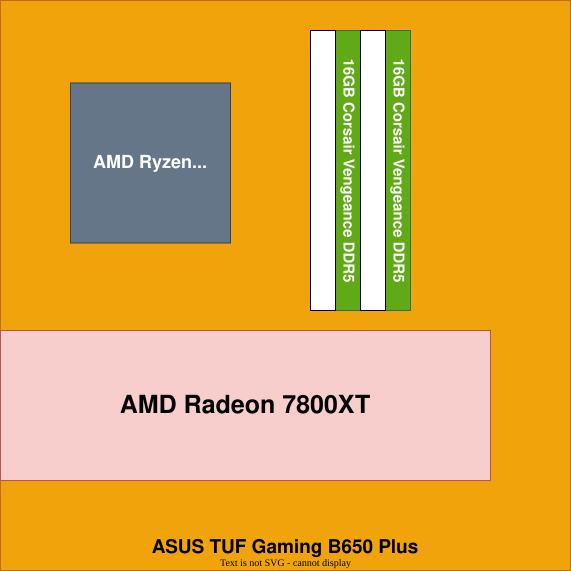

# Homelab & Infrastructure
Seit Mitte 2025 arbeite ich aktiv daran, meine Abhängigkeit von großen Cloudanbietern abzubauen und habe zu diesem Zweck einen Homeserver aufgesetzt. Dort hoste ich quelloffene Alternativen selbst und verteile die zur Verfügung stehenden Ressourcen so effizient, wie ich kann.

---

## Hardware
### Selbst konfigurierter und zusammengebauter PC
2023 habe ich mir den langjährigen Traum erfüllt, mir einen Gaming-PC zu bauen.

Von diesem Punkt ist das Wiederentdecken meiner Leidenschaft für die IT gestartet. Seitdem habe ich mich ununterbrochen technisch weiterentwickelt und meine Fähigkeiten und Kenntnisse ausgeweitet.

### Raspberry Pi 5
Nicht viel später habe ich nach einer Option gesucht, Spiele von meinem PC auf den Fernseher zu streamen, um dort mit Konsolenfeeling zu spielen. Ich habe mich informiert und mein erstes Networking-Projekt gestartet, indem ich einen Raspberry Pi als Client für das Open-Source Tool "[Moonlight](https://github.com/moonlight-stream)" einrichte und meinen Desktop vom PC aus mit "[Sunshine](https://github.com/lizardbyte/sunshine)" ins Netzwerk streame. Nachdem das funktioniert hat, war ich angefixt und bin im nächsten Jahr weitere Selfhosting-Projekte mit meinem PC als Host angegangen.

### Dell Wyse 5070
2025 habe ich dann die nächste Eskalationsstufe meines neuen Hobbies erreicht und mich nach dedizierter Hardware für den Einsatz als Home-Server umgeschaut, da ich nach einem Umzug Smart-Home Geräte installieren wollte und dafür ein System gebraucht habe, das 24/7 in Betrieb bleiben kann. Zunächst dachte ich an einen weiteren Raspberry Pi, habe mich aber schließlich für einen wiederaufgearbeiteten Mini-PC entschieden, mit dem ich auch zukünftige Projekte umsetzen kann.
Diesen habe ich mit einer NVMe SSD und mehr Arbeitsspeicher aufgerüstet und als Server aufgesetzt.

---
## Software
### Betriebssysteme & Hypervisor
Seit 2025 nutze ich Linux auf meinem Desktop. Aufgrund von Privacy-Bedenken, deplazierter Werbung und dem Wunsch, neue nützliche Fähigkeiten zu sammeln und mir Wissen anzueignen, habe ich mich entschieden, Windows zu verlassen. Die erste Distribution, die ich ausprobiert habe, war **[Pop!_OS](https://github.com/pop-os)**. Hier habe ich einige Monate mit gearbeitet, bis ich tiefer eintauchen wollte. Etwa seit Februar 2026 nutze ich **[Arch Linux](https://github.com/archlinux)** und **[Hyprland](https://github.com/hyprwm/hyprland)** als Environment.
Meinen Server betreibe ich mit **[Proxmox VE](https://github.com/proxmox)** als Virtualisierungsengine. Hier nutze ich weitgehend die [Helper-Scripts von tteck](https://github.com/tteck/Proxmox), um neue Linuxcontainer und Virtual Machines zu initialisieren.
